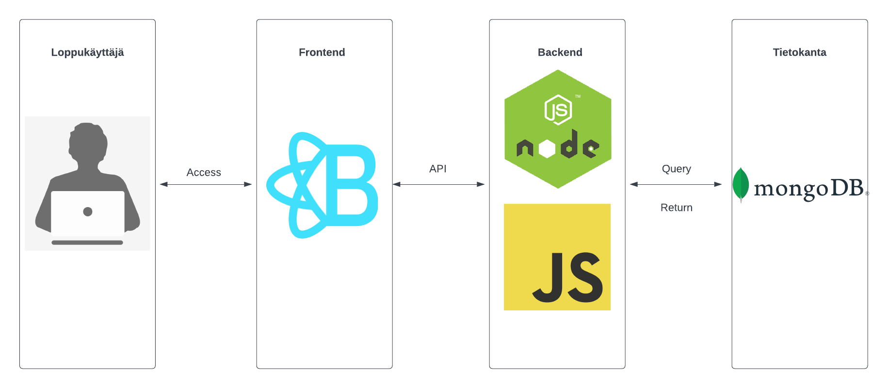
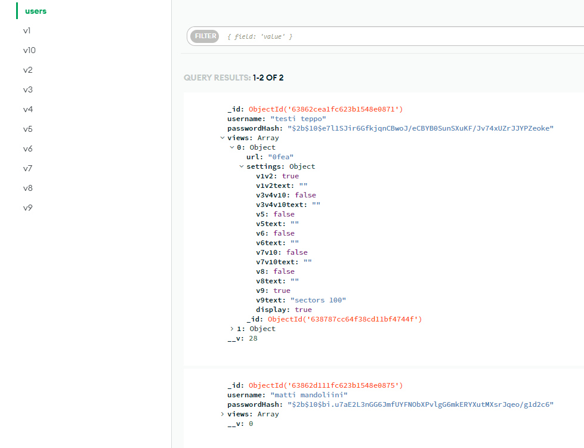

# Fall 2022 OAMK group project

## Project name: Climate data visualization tool

## Link to site: https://group5-visualizationtool-gbn4.onrender.com/ (data for the graphs may take a moment to appear)

## Projects topic and purpose
Projects topic was to create a visualization tool, that shows different types of graphs about climate change. Users may create an account so they can create their own custom visualization views and share them via unique URLs. Users may select which graphs they want to display and write custom descriptions for them if they choose to do so. All user made views can be found publicly with correct URL.

The purpose of the project was to get familiar with full-stack programming and the Kanban development model.

## Technologies and tools

### Frontend

Projects frontend was created using React.js, Bootstrap and CSS. npm was used for installing packages and such. Worth mentioning packages are Chart.js, React-Chartjs-2, Axios, Bootstrap and React-Bootsrap.

### Backend

Projects backend was created using Node.js, Express.js was also used for building the API. Most important package was Mongoose, which was used for creating a connection between Backend and Database.

### Database

MongoDB was chosen to be used mainly because of its fairly simple structure which is easy to learn/use.

### Testing
For Frontend testing we used Cypress which is a End to End (E2E) testing library.

For Backend testing we used integration test approach. We used Jest and SuperTest libraries for testing API.

## Architecture and structure

### Application structure

### Database structure

### Käyttöliittymäsuunnitelma
[UI design link](https://www.figma.com/file/tXrYVw573jIBt49oBs0tLg/Group5?node-id=0%3A1)

## How to run locally

1. Clone repository
2. Move to folder 'Client' and install all dependencies with command 'npm install', do the same inside 'Server' folder.
3. Start the apps frontend with command 'npm start' inside the 'Client' folder.
4. Start the apps backend with command 'npm run devStart' inside the 'Server' folder.

## What everyone did

### Anssi Rauhala
Worked with data, made 2 graphs, login, register and delete view functions, CSS, worked with backend/frontend, made backend tests.

### Junnu Kyrö
Worked with data, made 2 graphs, made 'luo uusi näkymä' function, created the user made view page, CSS, fetch graph data from database, worked with backend/frontend, made frontend tests.

[Link to Junnus GitHub](https://github.com/Jundeb)

### Antti-Jussi Niku
Worked with data, made 3 graphs, delete user function, responsives, initialization of the backend, fetch graph data from database, worked with backend/frontend.

[Link to Anttis GitHub](https://github.com/ArunJ0)

### Santtu Tiitinen
Worked with data, UI design, responsives, CSS.

[Link to Santtus GitHub](https://github.com/santtutiitinen)
